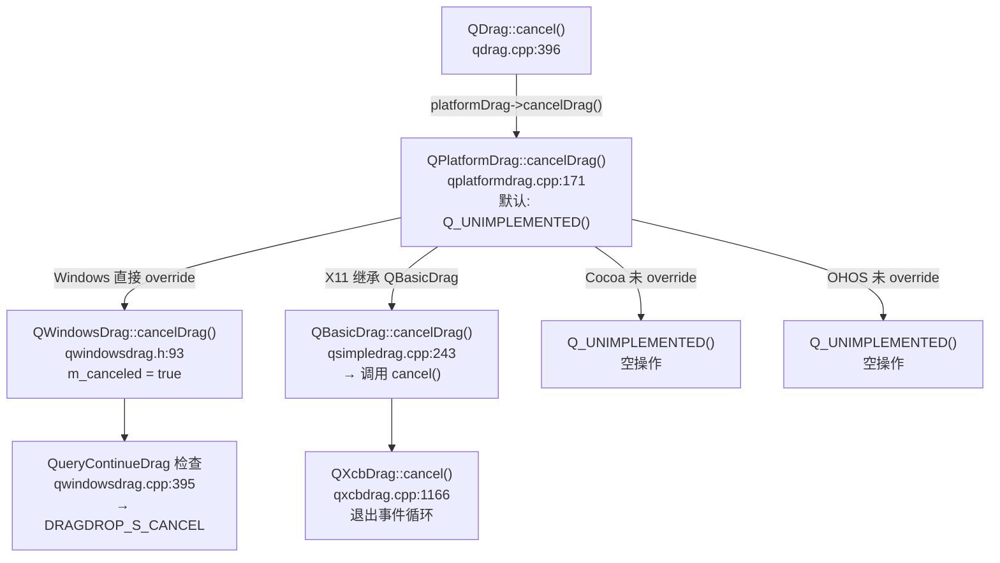

# QDrag::cancel() 跨平台适配现状分析

> 基于 Qt 5.15 鸿蒙适配分支（tqtc/harmonyos-5.15.16）源码，所有结论附 `file:line` 引用。

---

## 一、背景功能概述

`QDrag::cancel()` 是 Qt 提供的**静态公共 API**，用于编程式取消一个正在进行中的拖拽操作。

```cpp
// qdrag.h:87
static void cancel();
```

```cpp
// qdrag.cpp:396-400
void QDrag::cancel()
{
    if (QPlatformDrag *platformDrag = QGuiApplicationPrivate::platformIntegration()->drag())
        platformDrag->cancelDrag();
}
```

- **引入版本**：Qt 5.7（`qdrag.cpp:393` `// \since 5.7`）
- **调用链**：`QDrag::cancel()` → `QPlatformDrag::cancelDrag()`（虚函数）→ 各平台 QPA 插件实现
- **QPA 默认实现**：`Q_UNIMPLEMENTED()`，即空操作（`qplatformdrag.cpp:171-174`）

```cpp
// qplatformdrag.cpp:171-174 — 默认实现，什么都不做
void QPlatformDrag::cancelDrag()
{
    Q_UNIMPLEMENTED();
}
```

### 架构总览



---

## 二、场景概述

### 2.1 什么是编程式取消

`QDrag::cancel()` 与用户按 ESC 键取消不同。它是**应用代码主动中止**正在进行中的拖拽，典型场景：

| 场景 | 说明 |
|------|------|
| 超时取消 | 拖拽超过 N 秒未释放，自动中止（防止用户卡住或拖拽超时） |
| 业务中断 | 拖拽过程中数据校验失败 / 网络状态变化，主动中止拖拽 |
| 页面切换 | 拖拽进行中触发了页面跳转或弹窗，需要取消当前拖拽 |
| 竞争条件 | 另一个操作需要获取拖拽资源的独占控制权 |

### 2.2 与 ESC 键取消的区别

| 机制 | 触发方 | 路径 |
|------|--------|------|
| ESC 键取消 | 用户按键 | 各平台 OS 原生处理（Windows: `fEscapePressed`，`qwindowsdrag.cpp:395`） |
| `QDrag::cancel()` | 应用代码 | `QDrag::cancel()` → `QPlatformDrag::cancelDrag()` → 平台实现 |

> **注意**：Windows 的 ESC 取消走的是 OLE 原生回调 `QueryContinueDrag`，不经过 `QDrag::cancel()`。`QDrag::cancel()` 纯粹用于编程式取消。

---

## 三、多个平台的适配情况

### 3.1 适配总览

| 平台 | 是否实现 | 实现方式 | 关键代码 |
|------|:--------:|---------|---------|
| **Windows** | ✅ | 直接 override `cancelDrag()`，设静态 flag，OLE 回调检查 | `qwindowsdrag.h:93`, `qwindowsdrag.cpp:390-396` |
| **X11 (Linux)** | ✅ | 继承 `QBasicDrag`，`cancelDrag()` → `cancel()` 退出事件循环 | `qsimpledrag.cpp:243`, `qxcbdrag.cpp:1166` |
| **macOS (Cocoa)** | ❌ | 未 override，未继承 `QBasicDrag` | `qcocoadrag.mm/h` 全文无 cancelDrag |
| **OHOS (鸿蒙)** | ❌ | 未 override，未继承 `QBasicDrag` | `qohosplatformdrag.h:12-21` 无 override |

> Qt 官方文档（`qdrag.cpp:391`）明确注释：`"This is currently implemented on Windows and X11."`

### 3.2 详细对比

| 对比维度 | Windows | X11 (xcb) | macOS (Cocoa) | OHOS |
|---------|---------|-----------|---------------|------|
| `cancelDrag()` override | ✅ `qwindowsdrag.h:93` | ✅ 继承 `QBasicDrag`<br/>`qsimpledrag_p.h:77` | ❌ | ❌ |
| 继承 QBasicDrag | ❌ 直接继承 QPlatformDrag | ✅ `qxcbdrag.h:71` | ❌ | ❌ |
| cancel 检查点 | OLE `QueryContinueDrag`<br/>`qwindowsdrag.cpp:395`<br/>→ `DRAGDROP_S_CANCEL` | `QBasicDrag::cancelDrag()`<br/>`qsimpledrag.cpp:243-246`<br/>→ `cancel()` 退出事件循环 | 无 | 无 |
| ESC 键处理 | OS 原生 `fEscapePressed`<br/>`qwindowsdrag.cpp:395` | `QBasicDrag` 事件过滤<br/>`qsimpledrag.cpp:172,195` | 仓库无 cancel 相关代码 | 事件过滤器吞掉 KeyPress<br/>`qohosplatformdrag.cpp:82-88` |
| drag 阻塞机制 | OLE `DoDragDrop()` 同步阻塞 | `QBasicDrag` 本地事件循环 | 默认 Qt 机制 | `QEventLoop::exec()`<br/>`qohosplatformdrag.cpp:130` |
| 退出阻塞的途径 | OLE 返回 (cancel/drop) | 回调 quit 事件循环 | 默认 Qt 机制 | 原生回调 `ARKUI_DRAG_STATUS_ENDED`<br/>`qnativenode.cpp:479` |

### 3.3 各平台实现详解

#### Windows — ✅ 已实现

```cpp
// qwindowsdrag.h:93 — override cancelDrag
void cancelDrag() override { QWindowsDrag::m_canceled = true; }
```

```cpp
// qwindowsdrag.cpp:390-396 — OLE 回调检查 canceled flag
STDMETHODIMP QWindowsOleDropSource::QueryContinueDrag(BOOL fEscapePressed, DWORD grfKeyState)
{
    SCODE result = S_OK;
    if (fEscapePressed || QWindowsDrag::isCanceled()) {
        result = DRAGDROP_S_CANCEL;  // 通知 OLE 取消拖拽
    }
    // ...
}
```

**机制**：`cancelDrag()` 设置静态 `m_canceled = true` flag → OLE 在 `QueryContinueDrag` 回调中检查此 flag → 返回 `DRAGDROP_S_CANCEL` → OLE 取消拖拽 → `DoDragDrop()` 返回 → `drag->exec()` 返回 `Qt::IgnoreAction`。

#### X11 (xcb) — ✅ 已实现

```cpp
// qsimpledrag_p.h:71,77 — QBasicDrag 中间层 override 了 cancelDrag
class QBasicDrag : public QPlatformDrag, public QObject {
    void cancelDrag() override;  // line 77
    virtual void cancel();       // line 85 — 模板方法，子类实现
};
```

```cpp
// qsimpledrag.cpp:243-246 — cancelDrag 委托给 cancel()
void QBasicDrag::cancelDrag()
{
    // ... 退出事件循环
    cancel();
}
```

```cpp
// qxcbdrag.h:80 — QXcbDrag override cancel()
void cancel() override;

// qxcbdrag.cpp:1166-1177
void QXcbDrag::cancel()
{
    qCDebug(lcQpaXDnd) << "dnd was canceled";
    QBasicDrag::cancel();
    // ... 清理 Xdnd 状态
    canceled = true;
}
```

**机制**：`cancelDrag()`（QBasicDrag 继承）→ `cancel()`（QXcbDrag override）→ 退出本地事件循环 → 发送 XdndLeave 通知目标取消 → `drag->exec()` 返回。

#### macOS (Cocoa) — ❌ 未实现

`QCocoaDrag` 直接继承 `QPlatformDrag`，未 override `cancelDrag()`，也未继承 `QBasicDrag`。调用 `QDrag::cancel()` 落到 `QPlatformDrag::cancelDrag()` → `Q_UNIMPLEMENTED()` 空操作。

> 源码证据：`qcocoadrag.mm`、`qcocoadrag.h`、`qnsview_dragging.mm` 三个文件中 "cancel" / "abort" 关键词零匹配。

#### OHOS (鸿蒙) — ❌ 未实现

```cpp
// qohosplatformdrag.h:12-21 — QOhosPlatformDrag 声明，无 cancelDrag override
class QOhosPlatformDrag : public QPlatformDrag
{
public:
    QOhosPlatformDrag();
    ~QOhosPlatformDrag() override;
    virtual void handlePreDrop() = 0;       // 有 pre-drop 处理
    virtual void updateDropAction(Qt::DropAction) = 0;  // 有 action 更新
    // ❌ 无 cancelDrag() override
};
```

OHOS drag 阻塞机制（`qohosplatformdrag.cpp:108-135`）：

```cpp
// qohosplatformdrag.cpp:108-135 — drag() 用 QEventLoop 阻塞
Qt::DropAction QOhosPlatformDragImpl::drag(QDrag *drag)
{
    auto *initiatorView = findInitiatorViewForDragOrNull();
    m_activeEventFilterHandle = installDragEventFilter();  // 吞掉所有输入事件

    auto eventLoop = std::make_shared<QEventLoop>();
    m_dropAction = drag->defaultAction();

    initiatorView->startDrag(
        {dragPixmap.toImage()}, drag->hotSpot(),
        *drag->mimeData(),
        [this, eventLoop](Qt::DropAction dropAction) {  // 原生回调
            m_dropAction = dropAction;
            eventLoop->quit();  // 唯一退出途径
        });

    eventLoop->exec();  // 阻塞等待原生回调
    return m_dropAction;
}
```

OHOS 原生 drag 回调处理（`qnativenode.cpp:473-501`）：

```cpp
// qnativenode.cpp:473-493 — 原生回调处理 drag 结果
[context](::ArkUI_DragAndDropInfo *dragAndDropInfo) mutable {
    auto dragStatus = OH_ArkUI_DragAndDropInfo_GetDragStatus(dragAndDropInfo);

    if (dragStatus == ARKUI_DRAG_STATUS_ENDED) {  // 只处理 ENDED 状态
        ArkUI_DragResult dragResult = ARKUI_DRAG_RESULT_FAILED;
        OH_ArkUI_DragEvent_GetDragResult(dragEvent, &dragResult);

        auto qtDropAction =
            dragResult == ARKUI_DRAG_RESULT_SUCCESSFUL
                ? mapQOhosArkUiDropOperationToQt(...)
                : Qt::IgnoreAction;  // FAILED → IgnoreAction

        dropActionConsumer(qtDropAction);  // 触发 eventLoop->quit()
    }
}
```

**OHOS 影响分析**：

| 影响项 | 说明 |
|--------|------|
| 编程式 `QDrag::cancel()` | ❌ 无效。`cancelDrag()` → `Q_UNIMPLEMENTED()` 空操作，拖拽不会中止 |
| 是否会崩溃/卡死 | ❌ 不会。原生 drag 必然会结束（用户松手），回调触发 `eventLoop->quit()` |
| 用户 drop 到无效区域 | ✅ 正常。原生回调 `ARKUI_DRAG_RESULT_FAILED` → `Qt::IgnoreAction` |
| 用户正常 drop | ✅ 正常。原生回调 `ARKUI_DRAG_RESULT_SUCCESSFUL` → Qt drop action |
| ESC 键 | ❌ Qt 层不感知（事件过滤器吞掉 KeyPress，`qohosplatformdrag.cpp:82-88`） |

> **结论**：OHOS 缺少 `cancelDrag()` 导致**编程式取消场景失效**，但不会崩溃或死锁。拖拽会继续到原生系统自然结束。

---

## 四、使用 Demo（基于 Qt 官方示例）

以下基于 Qt 官方 `draggableicons` 示例（`qtbase/examples/widgets/draganddrop/draggableicons/`），在其基础上增加编程式取消（超时自动取消拖拽）的演示。

> **官方示例路径**：`qtbase/examples/widgets/draganddrop/draggableicons/dragwidget.cpp`

### 4.1 官方示例：标准拖拽发起

Qt 官方 `draggableicons` 的 `mousePressEvent`（`dragwidget.cpp:140-176`）：

```cpp
void DragWidget::mousePressEvent(QMouseEvent *event)
{
    QLabel *child = static_cast<QLabel*>(childAt(event->pos()));
    if (!child)
        return;

    QPixmap pixmap = *child->pixmap();

    // 序列化拖拽数据
    QByteArray itemData;
    QDataStream dataStream(&itemData, QIODevice::WriteOnly);
    dataStream << pixmap << QPoint(event->pos() - child->pos());

    QMimeData *mimeData = new QMimeData;
    mimeData->setData("application/x-dnditemdata", itemData);

    QDrag *drag = new QDrag(this);
    drag->setMimeData(mimeData);
    drag->setPixmap(pixmap);
    drag->setHotSpot(event->pos() - child->pos());

    // 半透明效果
    QPixmap tempPixmap = pixmap;
    QPainter painter;
    painter.begin(&tempPixmap);
    painter.fillRect(pixmap.rect(), QColor(127, 127, 127, 127));
    painter.end();
    child->setPixmap(tempPixmap);

    // exec() 同步阻塞，直到拖拽结束
    if (drag->exec(Qt::CopyAction | Qt::MoveAction, Qt::CopyAction) == Qt::MoveAction) {
        child->close();
    } else {
        child->setPixmap(pixmap);
    }
}
```

### 4.2 扩展：增加编程式取消（超时自动取消）

在官方示例基础上，增加一个超时定时器：拖拽超过 5 秒未释放，自动调用 `QDrag::cancel()` 取消。

```cpp
// dragwidget.h — 增加 timeout 成员
class DragWidget : public QWidget {
    // ...
private:
    QTimer *m_dragTimeout;  // 拖拽超时定时器
};
```

```cpp
// dragwidget.cpp — 增加超时取消逻辑
void DragWidget::mousePressEvent(QMouseEvent *event)
{
    QLabel *child = static_cast<QLabel*>(childAt(event->pos()));
    if (!child)
        return;

    QPixmap pixmap = *child->pixmap();

    QByteArray itemData;
    QDataStream dataStream(&itemData, QIODevice::WriteOnly);
    dataStream << pixmap << QPoint(event->pos() - child->pos());

    QMimeData *mimeData = new QMimeData;
    mimeData->setData("application/x-dnditemdata", itemData);

    QDrag *drag = new QDrag(this);
    drag->setMimeData(mimeData);
    drag->setPixmap(pixmap);
    drag->setHotSpot(event->pos() - child->pos());

    // ★ 新增：5 秒超时自动取消
    m_dragTimeout = new QTimer;
    m_dragTimeout->setSingleShot(true);
    connect(m_dragTimeout, &QTimer::timeout, [] {
        QDrag::cancel();  // 编程式取消当前拖拽
    });
    m_dragTimeout->start(5000);

    QPixmap tempPixmap = pixmap;
    QPainter painter;
    painter.begin(&tempPixmap);
    painter.fillRect(pixmap.rect(), QColor(127, 127, 127, 127));
    painter.end();
    child->setPixmap(tempPixmap);

    // exec() 同步阻塞
    Qt::DropAction result = drag->exec(Qt::CopyAction | Qt::MoveAction, Qt::CopyAction);

    m_dragTimeout->stop();
    m_dragTimeout->deleteLater();

    if (result == Qt::MoveAction) {
        child->close();
    } else {
        child->setPixmap(pixmap);
    }
}
```

### 4.3 运行效果（按平台）

| 平台 | 5 秒超时后行为 | `exec()` 返回值 |
|------|--------------|----------------|
| Windows | ✅ 拖拽立即中止，`exec()` 返回 | `Qt::IgnoreAction` |
| X11 (Linux) | ✅ 拖拽立即中止，`exec()` 返回 | `Qt::IgnoreAction` |
| macOS | ❌ 无效，拖拽继续，5 秒后定时器触发但 `cancel()` 空操作 | 用户松手后才返回 |
| OHOS | ❌ 无效，拖拽继续，5 秒后定时器触发但 `cancel()` 空操作 | 用户松手后才返回 |

> **注意**：在 Windows 上，`drag->exec()` 内部走 OLE `DoDragDrop()`，Qt 的 `QTimer` 依赖事件循环。OLE 的消息泵会处理 Qt 定时器事件，因此 `QTimer::timeout` 可以在拖拽期间触发。X11 上 `exec()` 走 `QBasicDrag` 本地事件循环，`QTimer` 同样可以正常触发。

---

## 五、结论汇总

| # | 结论 | 证据等级 | 关键代码引用 |
|---|------|:--------:|-------------|
| 1 | Windows ✅ 实现了 `cancelDrag()`，通过 OLE `DRAGDROP_S_CANCEL` 取消 | 充分 | qwindowsdrag.h:93, qwindowsdrag.cpp:390-396 |
| 2 | X11 ✅ 通过继承 `QBasicDrag` 间接实现，`cancelDrag()` → `cancel()` | 充分 | qsimpledrag_p.h:77, qsimpledrag.cpp:243, qxcbdrag.cpp:1166 |
| 3 | macOS ❌ 未实现，`cancelDrag()` 落到 `Q_UNIMPLEMENTED()` 空操作 | 充分 | qcocoadrag.mm/h 无 cancelDrag, qplatformdrag.cpp:171-174 |
| 4 | OHOS ❌ 未实现，`cancelDrag()` 落到 `Q_UNIMPLEMENTED()` 空操作 | 充分 | qohosplatformdrag.h:12-21 无 override, qplatformdrag.cpp:171-174 |
| 5 | OHOS 调用 `QDrag::cancel()` 不会崩溃/卡死，但静默无效 | 充分 | qplatformdrag.cpp:173 空操作 + qohosplatformdrag.cpp:130 事件循环靠原生回调退出 |
| 6 | OHOS 原生 drag 能感知 cancel 结果（`ARKUI_DRAG_RESULT_FAILED` → `Qt::IgnoreAction`） | 充分 | qnativenode.cpp:484-493 |

### 待验证事项

- [ ] OHOS 原生 ArkUI 拖拽框架是否有独立的 ESC/取消 API（需查 OHOS SDK 文档，当前仓库代码未调用）
- [ ] macOS 是否有其他非 QPA 层面的 drag cancel 机制（如 NSDraggingSession 原生 API）

---

## 附：源码文件索引

| 文件 | 路径（相对 qtbase/src） | 说明 |
|------|------------------------|------|
| qdrag.h / qdrag.cpp | gui/kernel/ | Qt 公共 API，`cancel()` 静态方法 |
| qplatformdrag.h / .cpp | gui/kernel/ | QPA 抽象层，`cancelDrag()` 虚函数 |
| qsimpledrag_p.h / .cpp | gui/kernel/ | `QBasicDrag` 中间基类，override `cancelDrag()` |
| qwindowsdrag.h / .cpp | plugins/platforms/windows/ | Windows QPA drag 实现 |
| qxcbdrag.h / .cpp | plugins/platforms/xcb/ | X11 QPA drag 实现 |
| qcocoadrag.h / .mm | plugins/platforms/cocoa/ | macOS QPA drag 实现 |
| qohosplatformdrag.h / .cpp | plugins/platforms/ohos/ | OHOS QPA drag 实现 |
| qnativenode.cpp | plugins/platforms/ohos/render/ | OHOS 原生 drag 回调处理 |

---

## 参考来源

- 🛠️ Qt 源码验证（Qt 5.15.16 OHOS 分支 `tqtc/harmonyos-5.15.16` commit 962aa625）：
  - `gui/kernel/qdrag.cpp:391,393,396` — `QDrag::cancel()` 静态方法实现 + 官方注释 "This is currently implemented on Windows and X11."
  - `gui/kernel/qplatformdrag.cpp:171,173` — `QPlatformDrag::cancelDrag()` 默认实现落到 `Q_UNIMPLEMENTED()`
  - `gui/kernel/qsimpledrag_p.h:71,77` / `qsimpledrag.cpp:172,243` — `QBasicDrag` 中间基类 override `cancelDrag()`（X11 事件循环）
  - `plugins/platforms/windows/qwindowsdrag.cpp:390,395` — Windows QPA 用 OLE flag 实现
  - `plugins/platforms/xcb/qxcbdrag.cpp:1166` — X11/XCB QPA 实现
  - `plugins/platforms/cocoa/` — macOS Cocoa QPA（`cancelDrag` 落 `Q_UNIMPLEMENTED()`）
  - `plugins/platforms/ohos/qohosplatformdrag.cpp:82,108,130` / `qohosplatformdrag.h:12` — OHOS QPA 空实现
  - `plugins/platforms/ohos/render/qnativenode.cpp:473,479,484` — OHOS 原生 drag 回调处理
- 📖 Qt 官方文档：
  - [draggableicons 示例](https://doc.qt.io/qt-5/qtwidgets-draganddrop-draggableicons-example.html)（`qtbase/examples/widgets/draganddrop/draggableicons/`）— 官方拖拽示例，本页 demo 基于此扩展
  - [QDrag Class 文档](https://doc.qt.io/qt-5/qdrag.html) — `cancel()` 静态方法 API 参考
- 💼 工作经验：OHOS 平台 `QDrag::cancel()` 行为验证（调用后静默无效，原生 drag 自然结束后 exec 返回，不崩溃不卡死）
- 相关知识页：[[qt-harmonyos-platform-limits]] §跨平台 API 差异、[[qt-harmonyos-api]] §拖拽 API
